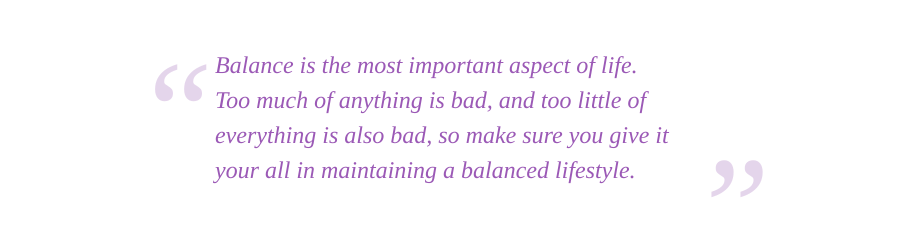

  
  
  

<h1 align="center">Hi, I'm Omar Ez-Eldin</h1>

  

<b>Computer Science Graduate (Cairo University) AI department</b>.

I build AI-powered applications. Some are just for fun, while others are more professional in nature. I'm a perfectionist, so I tend to spend a lot of time on unbounded tasks, but when there's a deadline, I deliver the best result within the given time constraint.

I love reading and learning in general. It doesn't have to be AI-related, or even computer science-related at all. There's a real thrill in being able to do something you couldn't do before, or in knowing something that might genuinely help you, or someone else, one day.

When I'm not studying, learning, or recovering from burnout, you'll find me gaming. I'm a gamer at heart, so I play every now and then to maintain a balanced life between work, learning, and relaxation.

---

<h2 align="center">Tech Stack</h2>

<table align="center">
  <tr>
    <th width="33%" align="center">Programming Languages</th>
    <th width="33%" align="center">AI &amp; Machine Learning Stack</th>
    <th width="33%" align="center">Frontend, Cloud &amp; Tooling Stack</th>
  </tr>
  <tr>
    <td align="center">
       
       
       
       
       
       
      
    </td>
    <td align="center">
       
       
       
       
       
       
       
       
       
      
    </td>
    <td align="center">
       
       
       
       
       
       
       
       
      
    </td>
  </tr>
</table>

---

<h2 align="center">Activity &amp; Contributions</h2>

<table align="center">
  <tr>
    <td width="50%" align="center" valign="middle">
      
    </td>
    <td width="50%" align="center" valign="middle">
       
       
       
      
    </td>
  </tr>
  <tr>
    <td colspan="2" align="center">
      
    </td>
  </tr>
</table>

---

<h2 align="center"><i>Braille Art</i></h2>

  

